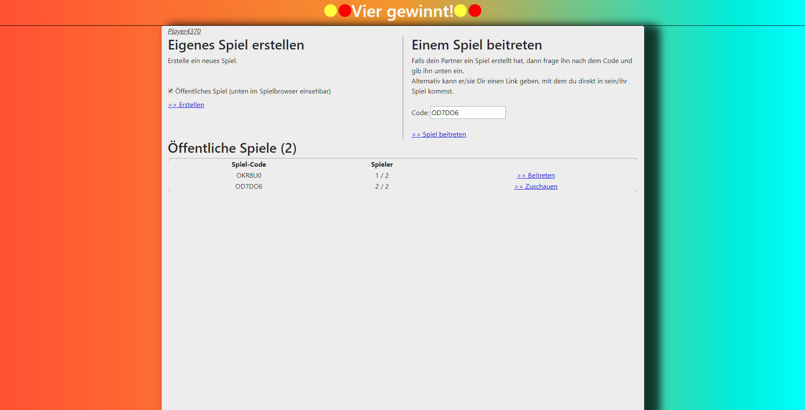
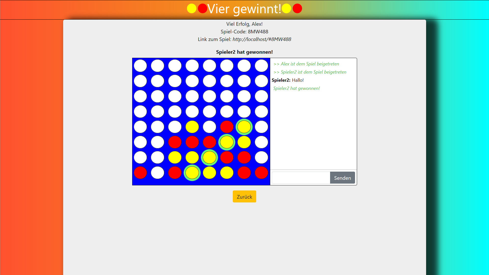
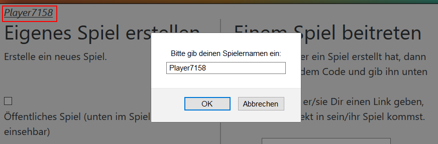
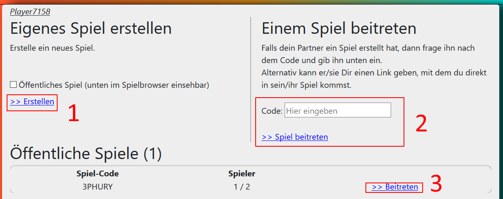
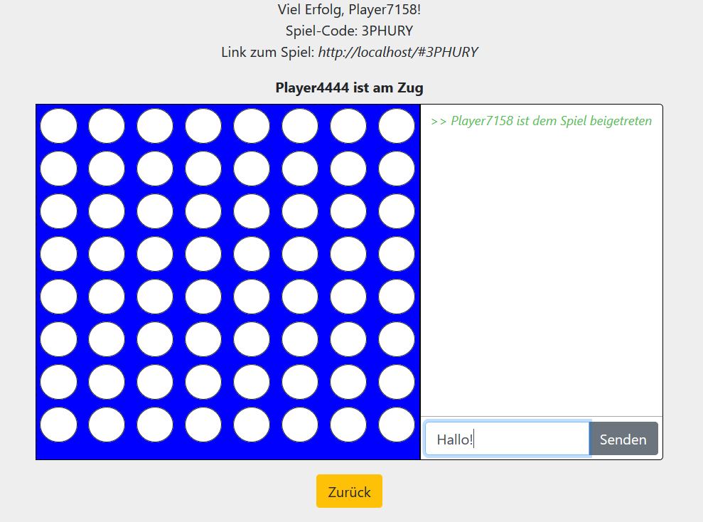

# Projekt: Vier Gewinnt! (Fr/2, Kr) <!-- omit in toc -->

> Bestimmt kennen Sie alle [Vier Gewinnt](https://de.wikipedia.org/wiki/Vier_gewinnt). Hierbei handelt es sich um ein Spiel für zwei Personen, bei dem die Spieler im Wechsel 
rote und gelbe Steine in ein (in unserem Fall) 8x8-Spielfeld legen. Wer es zuerst schafft, vier Steine seiner Farbe in eine Reihe (horizontal, vertikal oder diagonal) zu bringen,
gewinnt. Unsere Anwendung ist darauf ausgelegt, das Spiel auf zwei verschiedenen Rechnern gegeneinander zu spielen. Jeder kann sich beim Betreten der Seite einen Nutzernamen 
aussuchen. Dabei können auch mehrere Spiele gleichzeitig laufen. Das funktioniert, weil die Spiele in einzelnen Lobbies stattfinden, welche entweder öffentlich oder privat sein
können. Öffentliche Lobbies können über den Spiel-Browser auf der Startseite betreten werden, während man für private Lobbies eine Spiel-ID benötigt, die man vom Ersteller der 
Lobby erhält. Diese gibt man in das vorgesehene Feld auf der Startseite ein und betritt so das Spiel. Sobald eine Lobby voll ist, kann man ihr auch als Zuschauer beitreten und
mitchatten.

#### Startseite

#### Spielfeld

Keywords: WebSockets, Bootstrap, Responsive Design, Server-Sent Events (SSE), JSON Mapper, Static Files, JSON Mapper

Projektbeteiligte:

* Marlon Drolsbach
* Lars Köhler
* Alexander Pantelkin
* Felix Schopen

#### Inhalt
- [Die Idee](#die-idee)
- [Der Einstieg](#der-einstieg)
	- [Setup und Starten der Anwendung](#setup-und-starten-der-anwendung)
	- [UI im Browser aufrufen](#ui-im-browser-aufrufen)
	- [Erklärung des UI](#erkl%C3%A4rung-des-ui)
		- [Spielername](#spielername)
		- [Hauptseite](#hauptseite)
		- [Spielseite](#spielseite)
- [Der Aufbau der Anwendung](#der-aufbau-der-anwendung)
	- [Das Front-End](#das-front-end)
		- [UI](#ui)
		- [Kommunikation](#kommunikation)
	- [Das Back-End](#das-back-end)
		- [Spiellogik](#spiellogik)
		- [Serverlogik](#serverlogik)
- [Umsetzung der Spiellogik](#umsetzung-der-spiellogik)
- [Der Netzcode](#der-netzcode)
	- [SSE](#sse)
	- [Packets](#packets)
	- [Lobby Verbindung mit WebSockets](#lobby-verbindung-mit-websockets)

## Die Idee
Unser Ziel war es zunächst, eine Vier-Gewinnt-Anwendung zu schreiben. Diese wollten wir im Laufe des Projekts durch weitere Features erweitern:
* Das Spiel soll auf zwei verschiedenen Rechnern spielbar sein
* Jeder Spieler kann sich einen Namen aussuchen
* Es können mehrere Spiele gleichzeitig laufen
* Man kann sowohl private als auch öffentliche Spiele spielen
    * Private Spiele können über einen Code betreten werden
    * Öffentliche Spiele können in einem Browser eingesehen werden
* Es gibt eine Chatfunktion in jeder Lobby
* Man kann eine Lobby (sowohl öffentlich als auch privat) mit einer eigenen Lobby-Url betreten
* Man kann eine Lobby auch als Zuschauer betreten

## Der Einstieg
### Setup und Starten der Anwendung
Um die Anwendung zu starten, benötigt man das Tool [Gradle](https://gradle.org) und selbstverständlich Java. In der Konsole navigiert man in den Ordner, der 
die `build.gradle` Datei enthält. Hier führt man den Befehl `gradle run` aus. Nachdem alles Nötige heruntergeladen und kompiliert wurde, sollte nun automatisch der Javalin Server starten und das UI sollte unter `http://localhost/` erreichbar sein. 

### UI im Browser aufrufen
Als Host erreicht man die Seite im Internetbrowser
unter dem link `http://localhost/`. Andere Spieler müssen sich über die lokale [IP-Adresse]() des Hosts verbinden. Dazu müssen sie sich aber im selben 
Netzwerk wie der Host befinden. Man kann die Serveranwendung auch auf einem dedizierten Server starten, welcher dann von überall aus verfügbar ist.

### Erklärung des UI
Das UI besteht nur aus einer einzigen Seite, der `index.html`.
Sobald die Seite geladen wurde, sieht man ein Fenster, in das man seinen Spielernamen eingibt.

#### Spielername

Sobald man den Namen eingegeben hat, drückt man auf OK. Falls man den Namen ändern möchte, dann klickt man auf den unterstrichenen Spielernamen oben links (im Bild rot umrandet). Danach kommt man zur Hauptseite.

#### Hauptseite
Hier hat man drei Möglichkeiten:
1. Ein neues Spiel erstellen
2. Einem vorhandenen Spiel beitreten, indem man einen Spielcode eingibt
3. Ein Spiel aus dem Lobbybrowser aussuchen und beitreten

Option 3 ist jedoch nur verfügbar, falls jemand anderes ein öffentliches Spiel erstellt hat (einen Haken bei `Öffentliches Spiel` gesetzt).

#### Spielseite
Nach einem erfolgreichem Lobby-Beitritt sieht man das Spielfeld und den Lobby-Chat:

Oben sieht man die Spiel-Daten, wie zum Beispiel den Spielcode und die URL. Man kann diesen Spielcode einem Partner weitergeben und er kann somit dieser Lobby beitreten, indem er ihn auf der Hauptseite eingibt (Option 2). Alternativ kann auch die Lobby-Url weitergegeben werden, durch welche der Partner direkt in die Lobby kommt, ohne vorher einen Code eingeben zu müssen.

Weiter unten befindet sich das eigentliche Spiel.
Hier kann man mit den anderen Spielern chatten (rechts) und seinen Spielzug durchführen (links), indem man auf das Loch klickt, in das man seinen Spielstein werfen möchte. Natürlich "fällt" der Spielstein dann bis in das unterste Loch, falls man "in die Luft" geklickt hat.

> Hinweis: Falls man ein neues Spiel erstellt hat, dann erscheint das Spielfeld zunächst komplett blau. Das liegt daran, dass man die Spielfelddaten erst bekommt, wenn sich zwei Spieler zur Lobby verbunden haben. Man kann Vier Gewinnt eben nicht alleine spielen.

Am Ende befindet sich der `Zurück-Button`, welcher die Verbindung mit dem Spiel trennt und einen zurück auf die Hauptseite führt.

## Der Aufbau der Anwendung
Die Anwendung besteht aus zwei Teilen, die wiederum aus zwei weiteren Teilen bestehen:
* [**Das Front-End**](#das-front-end) (HTML, CSS und JavaScript)
  - *UI*
  - *Kommunikation mit Server*
* [**Das Back-End**](#das-back-end) (Java)
  - *Spiellogik*
  - *Serverlogik + Kommunikation mit Clients*

Der Code der Anwendung wurde kommentiert und sollte beim Lesen verständlich sein.

### Das Front-End
Hierzu gehören die Dateien, die vom Server an den Client (Webbrowser) ausgeliefert werden. Diese befinden sich im Ordner [`src/main/resources/public`](src/main/resources/public). Die Dateien kann man in `UI` und `Kommunikation` einteilen.
Der Startpunkt des Front-Ends liegt in der Datei `main.js`. Diese Datei initialisiert sowohl das UI-Skript als auch das Kommunikations-Skript.

#### UI
- `index.html`
- `ui.js`
- `main.css`

Diese Dateien steuern das Verhalten und das Aussehen von UI-Elementen auf der Webseite. `index.html` enthält alle UI Elemente und verweist auf die beiden Skripte und die CSS-Datei. `ui.js` speichert Referenzen auf die notwendigen UI-Elemente (z.B. der Spielfeld-Container oder das Chat-Textfeld), indem es diese nach ihrer ID sucht:

Methode updateUIReferences in ui.js

~~~javascript
// Lädt Referenzen auf UI Elemente neu.
function updateUIReferences() {
    createGameButton = document.getElementById('create-game-button');
    txtUserName = document.getElementById('username');
    createGameIsPublicBox = document.getElementById('create-game-public-box');
    joinGameButton = document.getElementById('join-game-button');
    joinGameId = document.getElementById('join-game-code');
    leaveGameButton = document.getElementById('leave-lobby');
    lobbyBrowser = document.getElementById('lobby-browser').querySelector('tbody');
    lobbyCounter = document.getElementById('lobby-counter');
    board = document.getElementById('board');
    chatMessagesContainer = document.getElementById('chat-messages-container');
    chatInputBox = document.getElementById('chat-input-box');
    chatSendButton = document.getElementById('chat-send-button');
    gameStatusContainer = document.getElementById('game-status-container');
    gameStatusText = document.getElementById('game-status-text');

    return createGameButton && createGameIsPublicBox && joinGameButton && joinGameId && leaveGameButton && lobbyBrowser && lobbyCounter && board && chatMessagesContainer && chatInputBox && chatSendButton && gameStatusContainer && gameStatusText;
}
~~~

Anschließend werden für diese Referenzen Events registriert (siehe Methode `initUI`), wie zum Beispiel Button-Klicks oder das Drücken der Enter-Taste (bei den Eingabefeldern).
Es werden noch viele weitere Methoden zur Verfügung gestellt, wie zum Beispiel `addChatMessage(message)`, welche eine Nachricht in das Chat-Fenster einfügt. Diese Methoden werden dann später vom Kommunikations-Skript verwendet, um Daten vom Server auf dem UI anzuzeigen. Die `main.css` beschreibt, wie die UI-Elemente dargestellt werden sollen (wie jede andere CSS Datei auch).

#### Kommunikation
Für die Kommunikation mit dem Server ist die Datei `connection.js` zuständig. Diese beinhaltet Funktionen zum Senden von Daten an den Server und zum Verarbeiten von Daten, die vom Server gesendet werden. Hier werden die Events vom Server mit SSE abgehört und Packets verarbeitet. Außerdem werden hier die Methoden zum Verbinden zur Lobby per WebSocket definiert (siehe `joinGame(gameId)`).
> Näheres zur Funktionsweise der Übertragung zwischen Server und Client siehe [Der Netzcode](#der-netzcode)

### Das Back-End
Hierzu gehören alle Dateien des [src/main/java](src/main/java)-Ordners. Die Dateien lassen sich einteilen in `Spiellogik` und `Serverlogik`. Der Einstiegspunkt für das Back-End befindet sich in `App.java`.

#### Spiellogik
Alle Klassen, die zur Spiellogik gehören, befinden sich im Package `de.battleship`. Diese stellen das eigentliche Spiel dar, ohne die Interaktion zwischen dem Webbrowser und dem Server.

#### Serverlogik
Alle Klassen, die zur Serverlogik gehören, befinden sich im Package `de.battleship.server`. Diese ermöglichen die Interaktion zwischen dem Webbrowser und der Spiellogik. Hier befinden sich die verschiedenen Packets, über welche der Server mit dem Client kommuniziert und Packet-Handler, welche die verschiedenen Packets vom Client verarbeiten. Außerdem werden hier Lobbies definiert, welche es erlauben, dass sich mehrere Spieler zu einem Spiel verbinden können.
> Näheres zur Funktionsweise der Übertragung zwischen Server und Client siehe [Der Netzcode](#der-netzcode)

## Umsetzung der Spiellogik
Intern besteht das Spielfeld aus einem zweidimensionalen Array namens `field`. Ist es leer, steht an jeder Stelle eine **0**. Bei der durchführung eines Spielzuges wird an der
richtigen Stelle eine **1** für **Spieler 1** oder eine **2** für **Spieler 2** eingefügt. Dazu wird die Methode `makeTurn()` verwendet:

Methode makeTurn()

~~~java
public boolean makeTurn(int column) {
    if (!checkWin()) {
        for (int i = field[column].length - 1; i >= 0; i--) {
            if (field[column][i] == 0) {
                field[column][i] = turn + 1;
                   changeTurn();
                   return true; // true, wenn ein gültiger Zug gemacht wurde
            }
        }
    }
    return false;
}

private void changeTurn() {
    if (!checkWin()) {
        this.turn++;
        this.turn %= this.players.length;
        }
}
~~~

  
 

Solange noch niemand gewonnen hat, wird in der gewünschten Spalte(column) der letzten Stelle, die den Wert **0** trägt, entweder **1** oder **2** zugewiesen und die Methode gibt
`true` zurück. Wenn entweder schon ein Spieler gewonnen hat oder die Spalte bereits voll ist, wird `false` zurückgegeben. Mithilfe von `changeTurn()` wechselt die Variable
`turn` jeden gültigen Spielzug zwischen den zwei Spielern (0/1).

Um zu ermitteln, ob einer der Spieler gewonnen hat, verwenden wir die Methode `checkWin()`:

Methode checkWin()

~~~java
boolean checkWin() {

    if (gameOver) {
        return true;
    }

    int currentPlayer = getTurn();

    // Prüft horizontal
    for (int j = 0; j < field.length - 3; j++) {
        for (int i = 0; i < field.length; i++) {
            if (field[i][j] == currentPlayer && field[i][j + 1] == currentPlayer && field[i][j + 2] == currentPlayer
                && field[i][j + 3] == currentPlayer) {
                
                field[i][j] = field[i][j + 1] = field[i][j + 2] = field[i][j + 3] = currentPlayer + 2;
                gameOver = true;
                winner = players[getTurn() - 1].name;
                return true;
            }
        }
    }

    
    // Dies ist eine gekürzte Version der Methode
    // In der richtigen Version folgen noch drei weitere Prüfungen für vertikal, diagonal(↗) und diagonal(↘)
    

    return false;
}
~~~

 

Die Variable `gameOver` vom Typ boolean wird benutzt, um zu prüfen, ob das Spiel bereits beendet ist. Wenn das nicht der Fall ist, wird mithilfe von vier verschachtelten FOR-Schleifen ermittelt,
ob vier nebeneinanderliegende Stellen dem Wert des Spielers, der am Zug ist, entsprechen. Dies geschieht horizontal, vertikal und diagonal in zwei Richtungen. Tritt dieser Fall
ein, wird die "gewinnende" Reihe mit einer `currentPlayer + 2` markiert. So erkennt man auch im Spielfeld welcher Spieler mit welcher Reihe gewonnen hat.
Nach einem abgeschlossenen Spiel könnte das Spielfeld-Array `field` beispielsweise intern so aussehen:  

~~~
0   0   0   0   0   0   2   3
0   0   0   0   0   0   2   3
0   0   0   0   0   0   2   3
0   0   0   0   0   0   0   3
0   0   0   0   0   0   0   0
0   0   0   0   0   0   0   0
0   0   0   0   0   0   0   0
0   0   0   0   0   0   0   0
~~~

Man sieht, das Spielfeld ist intern um 90° gedreht. Bei der Abbildung wird jedoch dafür gesorgt, dass es im Frontend korrekt angezeigt wird. Dafür werden die Methoden in der 
Klasse `HTMLGenerator` verwendet:

Klasse HTMLGenerator

~~~java
package de.battleship;

public class HTMLGenerator {
    public static String generateBoard(int[][] content) {
        StringBuilder boardString = new StringBuilder();

        for (int y = 0; y < content.length; y++) {
            boardString.append("
\n");
            for (int x = 0; x < content[y].length; x++)
                boardString.append(generateCellElement(x, content[x][y]));
            boardString.append("
\n");
        }

        return boardString.toString();
    }

    private static String generateCellElement(int column, int playerId) {
        return "\t
"
                +   "<button class=\"btn btn-light"
                +   (playerId == 1 ? " yellow-ball"
                            : playerId == 2 ? " red-ball"
                                    : playerId == 3 ? " yellow-ball winner" 
                                        : playerId == 4 ? " red-ball winner" : "")
                +   "\" type=\"button\" onclick=\"sendMove(" + column + ")\"></button>" 
                + "
\n";
    }
}
~~~

 

Die beiden Methoden generieren einen HTML-Code, der dem aktuellen Spielfeld entspricht. Man muss dabei beachten, dass `x` und `y` in der FOR-Schleife von
`generateBoard()` vertauscht sein müssen, damit das Spielfeld nicht um 90° gedreht angezeigt wird. 

Beispiel HTML-Code

~~~html

	
<button class="btn btn-light" type="button" onclick="sendMove(0)"></button>

	
<button class="btn btn-light" type="button" onclick="sendMove(1)"></button>

	
<button class="btn btn-light" type="button" onclick="sendMove(2)"></button>

	
<button class="btn btn-light" type="button" onclick="sendMove(3)"></button>

	
<button class="btn btn-light" type="button" onclick="sendMove(4)"></button>

	
<button class="btn btn-light" type="button" onclick="sendMove(5)"></button>

	
<button class="btn btn-light" type="button" onclick="sendMove(6)"></button>

	
<button class="btn btn-light" type="button" onclick="sendMove(7)"></button>

	
<button class="btn btn-light" type="button" onclick="sendMove(0)"></button>

	
<button class="btn btn-light" type="button" onclick="sendMove(1)"></button>

	
<button class="btn btn-light" type="button" onclick="sendMove(2)"></button>

	
<button class="btn btn-light" type="button" onclick="sendMove(3)"></button>

	
<button class="btn btn-light" type="button" onclick="sendMove(4)"></button>

	
<button class="btn btn-light" type="button" onclick="sendMove(5)"></button>

	
<button class="btn btn-light" type="button" onclick="sendMove(6)"></button>

	
<button class="btn btn-light" type="button" onclick="sendMove(7)"></button>

	
<button class="btn btn-light" type="button" onclick="sendMove(0)"></button>

	
<button class="btn btn-light" type="button" onclick="sendMove(1)"></button>

	
<button class="btn btn-light" type="button" onclick="sendMove(2)"></button>

	
<button class="btn btn-light" type="button" onclick="sendMove(3)"></button>

	
<button class="btn btn-light" type="button" onclick="sendMove(4)"></button>

	
<button class="btn btn-light" type="button" onclick="sendMove(5)"></button>

	
<button class="btn btn-light" type="button" onclick="sendMove(6)"></button>

	
<button class="btn btn-light" type="button" onclick="sendMove(7)"></button>

	
<button class="btn btn-light" type="button" onclick="sendMove(0)"></button>

	
<button class="btn btn-light" type="button" onclick="sendMove(1)"></button>

	
<button class="btn btn-light" type="button" onclick="sendMove(2)"></button>

	
<button class="btn btn-light" type="button" onclick="sendMove(3)"></button>

	
<button class="btn btn-light" type="button" onclick="sendMove(4)"></button>

	
<button class="btn btn-light" type="button" onclick="sendMove(5)"></button>

	
<button class="btn btn-light" type="button" onclick="sendMove(6)"></button>

	
<button class="btn btn-light" type="button" onclick="sendMove(7)"></button>

	
<button class="btn btn-light" type="button" onclick="sendMove(0)"></button>

	
<button class="btn btn-light" type="button" onclick="sendMove(1)"></button>

	
<button class="btn btn-light" type="button" onclick="sendMove(2)"></button>

	
<button class="btn btn-light" type="button" onclick="sendMove(3)"></button>

	
<button class="btn btn-light" type="button" onclick="sendMove(4)"></button>

	
<button class="btn btn-light" type="button" onclick="sendMove(5)"></button>

	
<button class="btn btn-light" type="button" onclick="sendMove(6)"></button>

	
<button class="btn btn-light" type="button" onclick="sendMove(7)"></button>

	
<button class="btn btn-light" type="button" onclick="sendMove(0)"></button>

	
<button class="btn btn-light" type="button" onclick="sendMove(1)"></button>

	
<button class="btn btn-light" type="button" onclick="sendMove(2)"></button>

	
<button class="btn btn-light" type="button" onclick="sendMove(3)"></button>

	
<button class="btn btn-light" type="button" onclick="sendMove(4)"></button>

	
<button class="btn btn-light" type="button" onclick="sendMove(5)"></button>

	
<button class="btn btn-light" type="button" onclick="sendMove(6)"></button>

	
<button class="btn btn-light" type="button" onclick="sendMove(7)"></button>

	
<button class="btn btn-light yellow-ball" type="button" onclick="sendMove(0)"></button>

	
<button class="btn btn-light yellow-ball" type="button" onclick="sendMove(1)"></button>

	
<button class="btn btn-light yellow-ball" type="button" onclick="sendMove(2)"></button>

	
<button class="btn btn-light" type="button" onclick="sendMove(3)"></button>

	
<button class="btn btn-light" type="button" onclick="sendMove(4)"></button>

	
<button class="btn btn-light" type="button" onclick="sendMove(5)"></button>

	
<button class="btn btn-light" type="button" onclick="sendMove(6)"></button>

	
<button class="btn btn-light" type="button" onclick="sendMove(7)"></button>

	
<button class="btn btn-light red-ball winner" type="button" onclick="sendMove(0)"></button>

	
<button class="btn btn-light red-ball winner" type="button" onclick="sendMove(1)"></button>

	
<button class="btn btn-light red-ball winner" type="button" onclick="sendMove(2)"></button>

	
<button class="btn btn-light red-ball winner" type="button" onclick="sendMove(3)"></button>

	
<button class="btn btn-light" type="button" onclick="sendMove(4)"></button>

	
<button class="btn btn-light" type="button" onclick="sendMove(5)"></button>

	
<button class="btn btn-light" type="button" onclick="sendMove(6)"></button>

	
<button class="btn btn-light" type="button" onclick="sendMove(7)"></button>

~~~

 

## Der Netzcode
Eine große Herausforderung war es, den Netzcode zu entwickeln. Es wurden hohe Anforderungen an ihn gestellt. Dieser musste nämlich:
1. schnell Lobbies erstellen und im Lobby-Browser auflisten können
2. die Einträge des Lobby-Browsers in fast Echtzeit aktualisieren können
3. Chat-Nachrichten in Echtzeit übertragen
4. Spielerzüge und Spielfelddaten in Echtzeit übertragen
5. Lobbies unterstützen, damit nur bestimmte Spieler eine Nachricht oder Spielfelddaten erhalten

Das alles musste der Netzcode ohne große Verzögerungen bewältigen können. Uns ist aufgefallen, dass man diese Anforderungen in zwei Teile aufteilen kann:
* Die Punkte 1 und 2 steuern nur die Elemente auf der [Hauptseite](#hauptseite) (`Lobby-Browser` und der `Spiel erstellen` Button). Außerdem darf die Verzögerung zwar nicht groß sein, jedoch ist es in Ordnung, falls eine neu erstellte Lobby zum Beispiel erst nach einer Sekunde bei den anderen Clients angezeigt wird.
* Die anderen Punkte haben nur etwas mit der [Spielseite](#spielseite) zu tun und erfordern die Übertragung in Echtzeit (ohne Verzögerungen)

Deshalb haben wir uns dazu entschieden, für die Punkte 1 und 2 mit SSE und POST-Requests zu arbeiten. Die Lobbydaten werden dann per Event übertragen und das Erstellen einer Lobby wird mit einem POST-Request realisiert. Für die restlichen Punkte möchten wir WebSockets benutzen, da sie schnell sind und man eine einzige dauerhafte Verbindung zwischen dem Server und dem Client hat (mit SSE hätte man zwar auch eine dauerhafte Verbindung, diese ist jedoch nur einseitig, d.h., man kann keine Daten vom Client zum Server senden). Dadurch kann man das Client-Objekt (in Javalin ein Objekt von `WsSession`) in einer Liste speichern, die sich in einem Lobby-Objekt befindet. Somit könnte man auch die Lobbies realisieren.

Dadurch gibt es im Server-Code auch die Unterscheidung zwischen `web` (SSE und POST-Requests) und `game` (WebSockets und Lobbies).

### SSE
Die Implementierung von SSE ist dank Javalin nicht schwer. Diese vier Zeilen aus `WebHandler.java` fügen neue SSE Clients, die sich mit `/lobbylist` verbinden, in eine Liste ein (und entfernt diese wieder, wenn die Verbindung getrennt wird):

SSE connect handler aus WebHandler.java

~~~java
this.server.sse("/lobbylist", client -> {
	client.onClose(() -> this.lobbiesListEventClients.remove(client));
	this.lobbiesListEventClients.add(client);
});
~~~

Falls sich eine Lobby ändert (z.B. die Spielerzahl ändert sich, neue Lobby wird erstellt/geschlossen, usw.), so muss diese Liste durchlaufen werden und an jeden Client ein bestimmtes Event gesendet werden, wie folgt:

SSE broadcast event aus WebHandler.java

~~~java
for (int i = this.lobbiesListEventClients.size() - 1; i >= 0; i--)
	this.lobbiesListEventClients.get(i).sendEvent("updlobby", jsonData);
~~~

Hier wird das Event `updlobby` an alle SSE Clients in der Liste gesendet.

Das Event wird folgendermaßen auf der Clientseite abgefangen (natürlich in `connection.js`):

SSE handler aus connection.js

~~~javascript
let lobbyBrowserEvents = new EventSource('/lobbylist');
	
// [...]

// Events, die vom Server gesendet werden (addlobby, rmlobby & updlobby)
lobbyBrowserEvents.addEventListener('addlobby', (event) => addLobbyToBrowser(JSON.parse(event.data)));
lobbyBrowserEvents.addEventListener('rmlobby', (event) => removeLobbyFromBrowser(JSON.parse(event.data)));
lobbyBrowserEvents.addEventListener('updlobby', (event) => updateLobbyInBrowser(JSON.parse(event.data)));
~~~

Hier werden die Events `addlobby`, `rmlobby` und `updlobby` abgefangen und verarbeitet. Eigentlich ganz simpel.

### Packets
Die Kommunikation zwischen dem Server und dem Client findet ausschließlich im Format `JSON` statt. Im JavaScript kann man JSON-Objekte direkt im Code erstellen und auslesen, für den Java-Server hat Javalin zum Glück eine Library (`Jackson`), sodass wir die JSON-Strings nicht selbst parsen müssen.

`Jackson` kann Objekte in einen JSON-String umwandeln. Es nimmt alle `öffentlichen Felder` (und die, die mit einer speziellen Annotation versehen sind) und deren Werte und wandelt dies dann in einen JSON-String um. Das Ganze funktioniert auch rückwärts. Aus einem JSON-String kann `Jackson` unter Angabe einer Klasse ein Objekt von dieser Klasse erzeugen und die Werte aus dem JSON-String in das Objekt schreiben. Das heißt, dass die Packets einfach nur Datenklassen sind, die nur benutzt werden, um in JSON (oder zurück) umgewandelt zu werden.

Dazu brauchen wir nur Folgendes:

ObjectMapper Beispiel Objekt->JSON

~~~java
ObjectMapper jsonConverter = new ObjectMapper();
jsonConverter.writeValueAsString(packet);
~~~

Wenn wir als `packet` eine Datenklasse übergeben mit beliebigen Werten, dann werden diese in einen JSON-String umgewandelt, den wir an den Client senden können.

Um ein Packet aus einem JSON-String in ein Packet umzuwandeln braucht man nur Folgendes:

ObjectMapper Beispiel JSON->Objekt

~~~java
jsonConverter.readValue(data, Packet.class)
~~~

`Packet` steht hier für die Klasse, aus der ein Objekt erzeugt wird, in das die Werte geschrieben werden. Doch woher wissen wir, welche Klasse wir genau brauchen? Wir haben doch mehrere Packets...

Genau deswegen gibt es die PacketIDs in `GamePacket.java` und `connection.js`. Diese werden mitgesendet und dann vom Handler in einem Register nachgeschaut, um welches Packet es sich denn gerade handelt.

So sieht das Register in `connection.js` aus:

Packet-Register connection.js

~~~javascript
let Packet = {
    In: {
        ERROR: 0,
        CONNECT_SUCCESS: 1,

        GAME_STATE: 16,
        CHAT_MESSAGE: 17
    },
    Out: {
        PING: 0,
        CONNECT_REQUEST: 1,

        PLAYER_MOVE: 16,
        CHAT_MESSSAGE: 17
    }
};
~~~

Wenn zum Beispiel ein Packet mit der ID 17 ankommt, dann weiß der Handler, dass es sich hierbei um eine Chat-Nachricht handelt.

Man sieht hier auch eine Unterscheidung zwischen `InPackets` und `OutPackets`. `InPackets` sind lediglich `eingehende Packets` (die Packets, die von der Gegenseite gesendet werden). `OutPackets` sind `ausgehende Packets` (die Packets, die versendet werden).

### Lobby Verbindung mit WebSockets
Am Anfang stellte sich die Frage, wie man denn die Lobbies mit WebSockets realisieren könnte. Wenn man zum Beispiel einen WebSocket-Listener öffnet mit:

WebSocket-Listener

~~~java
this.server.ws("/test", ws -> {
	ws.onConnect(this::handleNewClient);
	ws.onMessage(this::handleClientMessage);
	ws.onClose(this::handleClientDisconnect);
});
~~~

Dann ist dieser Listener dauerhaft aktiv auf `/test`. Wir haben uns aber überlegt, dass wir statt `/test` lieber die Lobby-ID haben möchten, um die Lobby zu identifizieren, die der Spieler versucht zu erreichen. Da die Lobbies aber auch geschlossen werden können, sollten wir auch den WebSocket-Listener schließen, damit sich niemand mehr mit dieser Lobby verbinden kann. Wir haben leider keine Möglichkeit gefunden, das zu realisieren. Stattdessen haben wir Folgendes gemacht:

WebSocket-Listener mit LobbyID

~~~java
this.server.ws("/:lobby-id", ws -> {
	ws.onConnect(this::handleNewClient);
	ws.onMessage(this::handleClientMessage);
	ws.onClose(this::handleClientDisconnect);
});

private void handleNewClient(WsSession session) {
	Lobby lobby = App.getLobbyManager().getLobbyById(session.pathParam("lobby-id"));

	// [...]
}
~~~

Hier benutzen wir `/:lobby-id` als Platzhalter. Den Wert des Platzhalters erhalten wir durch `session.pathParam("lobby-id")`. Wenn wir uns also zum Beispiel per WebSocket auf `ws://localhost/ABC123` verbinden, dann erhalten wir durch `session.pathParam("lobby-id")` den Wert `ABC123`. Somit können wir die Lobby identifizieren und z.B. den erhaltenen Spielerzug an die Lobby weitergeben.
