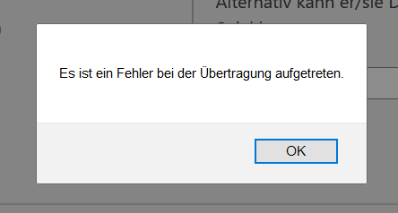

# Projekt: Vier Gewinnt! (Fr/2, Kr)

> Bestimmt kennen Sie alle [Vier Gewinnt](https://de.wikipedia.org/wiki/Vier_gewinnt). Hierbei handelt es sich um ein Spiel für zwei Personen, bei dem die Spieler im Wechsel rote und gelbe Steine in ein (in unserem Fall) 8x8-Spielfeld legen. Wer es zuerst schafft, vier Steine seiner Farbe in eine Reihe (horizontal, vertikal oder diagonal) zu bringen, gewinnt. Unsere Anwendung ist darauf ausgelegt, das Spiel auf zwei verschiedenen Rechnern gegeneinander zu spielen. Jeder kann sich beim betreten der Seite einen Nutzernamen aussuchen. Dabei können auch mehrere Spiele gleichzeitig laufen. Das funktioniert, weil die Spiele in einzelnen Lobbies stattfinden, welche entweder öffentlich oder privat sein können. Öffentliche Lobbies können über den Spiel-Browser auf der Startseite betreten werden, während man für private Lobbies eine Spiel-ID benötigt, die man vom ersteller der Lobby erhält. Diese gibt man in das vorgesehene Feld auf der Startseite ein und betritt so das Spiel.

Keywords: Websockets, Bootstrap, responsive Design, Server-Sent Events (SSE), MongoDB

Projektbeteiligte:

* Marlon Drolsbach
* Lars Köhler
* Alexander Pantelkin
* Felix Schopen

- [Projekt: Battleship (Fr/2, Kr)](#projekt-battleship-fr2-kr)
  - [Die Darstellung des Spielbretts](#die-darstellung-des-spielbretts)
  - [Die Idee](#die-idee)
  - [Skizzen zur grafischen Oberfläche](#skizzen-zur-grafischen-oberfl%C3%A4che)
  - [Umsetzung der Anwendungsidee](#umsetzung-der-anwendungsidee)
  - [Lorem ipsum](#lorem-ipsum)

## Die Darstellung des Spielbretts

Officia aliquip elit eu dolor anim. Ut ullamco labore pariatur proident. Duis enim officia nostrud eu culpa. Consequat laborum amet deserunt eiusmod. Ea cupidatat est labore culpa. Nisi voluptate duis consectetur ut eiusmod deserunt. Anim elit excepteur aliquip adipisicing eiusmod ex officia elit velit dolor ipsum enim nostrud consequat.

Nostrud officia ipsum sint qui adipisicing elit deserunt ullamco labore labore. Quis ex enim cupidatat Lorem. Pariatur incididunt excepteur aliqua enim dolore. Incididunt consectetur reprehenderit occaecat fugiat fugiat aliqua adipisicing aute tempor proident. Cillum ut dolore aute officia.

Consectetur qui id ea enim mollit ut in anim sunt exercitation sit qui. Velit est cupidatat culpa ipsum dolor consequat ea excepteur do id non nostrud consectetur enim. Voluptate nostrud laboris aute qui eiusmod. Lorem tempor aliquip nostrud Lorem. Anim ipsum Lorem velit do magna nulla commodo velit deserunt veniam in tempor.

Aliquip dolor occaecat do ad qui amet. Reprehenderit sit est non anim anim proident sint velit ea. Irure minim quis ut quis. Ipsum non amet adipisicing veniam pariatur anim non et nostrud eu. Ex consectetur fugiat deserunt qui est irure adipisicing ipsum magna irure. Consequat cillum id esse sunt fugiat aliquip veniam enim commodo irure elit.

## Die Idee

## Skizzen zur grafischen Oberfläche

## Umsetzung der Anwendungsidee

## Lorem ipsum

